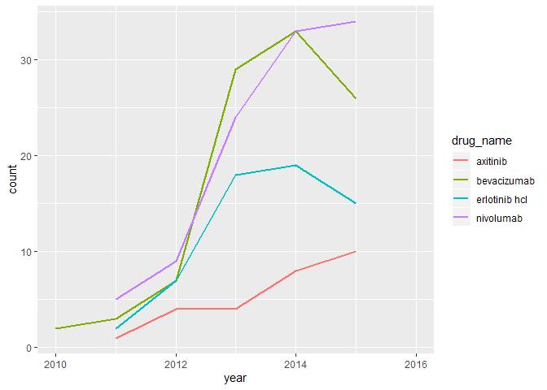
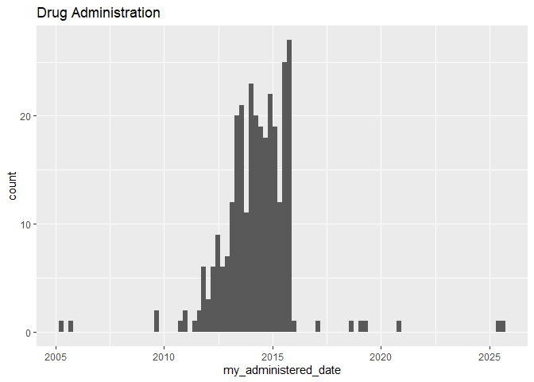
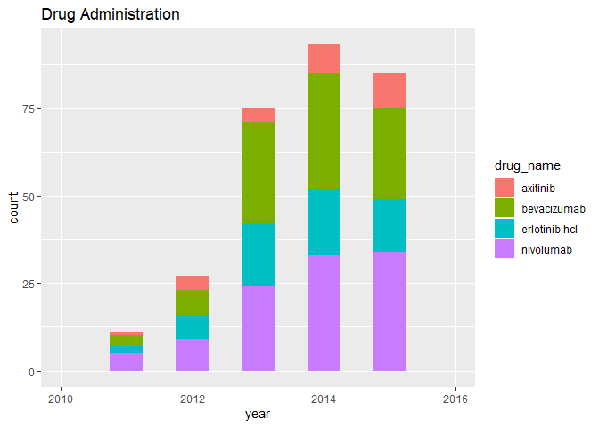
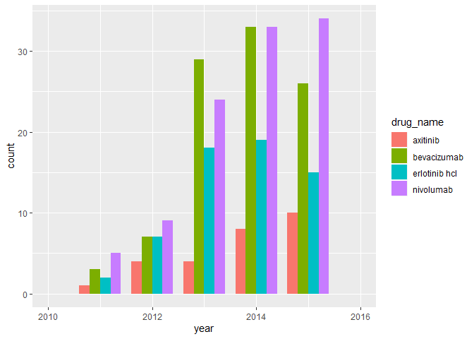

Technical Test: Quantitative Sciences Markdown
================
David DeStephano
February 13, 2019

Your datasets consist of:
-------------------------

Medication orders

patient\_id: patient identifier for internal purposes

external\_patient\_id: patient identifier for external (client) purposes

order\_id: unique identifier of each medication ordered by a health provider

order\_date: date in which medication was ordered by a health provider

Medication administrations

patient\_id: patient identifier for internal purposes

external\_patient\_id: patient identifier for external (client) purposes

order\_id: unique identifier of each medication ordered for a patient by a health provider

administered\_date: date in which ordered medication was administered

drug\_name: drug administered to patient

Patient demographics

patient\_id: patient identifier for internal purposes

gender: gender of patient

age: age of patient at the time of diagnosis

race: racial group classification of patient

Patients

patient\_id: patient identifier for internal purposes

external\_patient\_id: patient identifier for external purposes

external\_practice\_id: practice identifier for external purposes

internal\_practice\_id: practice (site at which patient receives oncology care) identifier for Internal purposes

diagnosis\_date: date on which patient was initially diagnosed

advanced\_diagnosis\_date: date on which patient was diagnosed as advanced

Practices

practice\_id: client identifier for internal purposes

external\_practice\_id: client identifier for external (client) purposes

emr\_system: software product used by the client

(OncoE = OncoEMR; OncoA = OncoAnalytics; OncoB = OncoBilling) practice\_type: classification of practice into either community or academic bucket active: status of client

1. When presented with a new dataset or database, what steps do you generally take to evaluate it prior to working with it?
---------------------------------------------------------------------------------------------------------------------------

My first step when working with a new dataset it to become familiar with the variables and their significance using the data dictionary or metadata. I then determine the structure of the data, what format the files are in, the quality of the data (are there missing values, formatting issues?). If I am working with a particularly large dataset, I will inspect the first one hundred rows. I will then determine how the data needs to be cleaned or if there are any variables that need to be transformed for my analysis. In most situations I will produce summary statistics or visualizations as an initial step to familiarize myself with the distribution and parameters of the data, and perhaps determine if there are any outliers or irregularities (non-normality, skewness), depending on my planned analysis.

2. Based on the information provided above and the attached dataset, what 3 questions would you like to understand prior to conducting any analysis of the data?
----------------------------------------------------------------------------------------------------------------------------------------------------------------

1.  What hypothesis do we want to test/what trends and insights do we expect to discover in the data?
2.  What are the best ways to analyze the data to determine any meaningful relationships given its content/variables?
3.  How will the analysis be used once it is completed?

3. How would you prep the dataset provided for analysis? Please list steps taken and provide code used to prep the tables for analysis.
---------------------------------------------------------------------------------------------------------------------------------------

-   Convert the data into a usable format. It is currently saved as an excel worksheet with several sheets, so the sheets need to be extracted and read into R. This could be achieved by simply saving each sheet as a separate CSV and reading them into R, but it is also possible to use the “readxl” package to import the individual sheets, and then read them in.

``` r
library(readxl)
library(tidyverse)
```

``` r
data<-readxl::excel_sheets("flatiron_qs_orders_admins_july_16.xlsx") %>% map(~readxl::read_excel("flatiron_qs_orders_admins_july_16.xlsx", .x)) %>% set_names(excel_sheets("flatiron_qs_orders_admins_july_16.xlsx"))

write.csv(data$Orders, file = "Orders.csv")
write.csv(data$Admins, file = "Admins.csv")
write.csv(data$Demographics, file = "Demographics.csv")
write.csv(data$Patients, file = "Patients.csv")
write.csv(data$Practices, file = "Practices.csv")

Orders<-read.csv("Orders.csv", stringsAsFactors=FALSE)
Admins<-read.csv("Admins.csv", stringsAsFactors=FALSE)
Demographics<-read.csv("Demographics.csv", stringsAsFactors=FALSE)
Patients<-read.csv("Patients.csv", stringsAsFactors=FALSE)
Practices<-read.csv("Practices.csv", stringsAsFactors=FALSE)
```

-   With the data in R, we can see there are two data frames (Demographics and Patients) with 101 observations, and two (Orders, and Admins) with 304 observations. After inspecting the two pairs, it makes sense to join the pairs with equal observations on a few key identifiers (similar to SQL) to simplify the analysis. I will name the new combined Patient and Demographic table as “DF”, and the combined Orders and Admins table as “DF2”, for simplicity. I will also use a full join so I do not lose any patients that may not have a common identifier between the tables.

``` r
DF<-full_join(Patients, Demographics, by='patient_id')
DF2<-full_join(Admins, Orders, by=c("patient_id", "external_patient_id", "order_id"))
```

-   Finally, it appears we will need to format the date variables so they can be included in the analysis. Looking ahead, the dates that are necessary in the analysis are “administered date” in “DF2” and “diagnosis\_”date” in “DF”. Strangely, there appear to be several observations that are not formatted the same as the majority of observations (21-Aug-2013, versus 2018-09-19, for example). This will need to be accounted for. The new formatted date variables will be called “my\_administered\_date”, and “my\_diagnosis\_date”

``` r
#Administed dates are in two different formats, have to account for both separately and merge the output into a single variable:
DF2$my_administered_date <- as.Date(DF2$administered_date,format="%d-%b-%Y")
DF2$b<-as.Date(DF2$administered_date,format="%Y-%m-%d")
DF2<-DF2 %>% mutate(my_administered_date = coalesce(my_administered_date,b))
DF2$b<-NULL

#Diagnosis dates:
DF$my_diagnosis_date <- as.Date(DF$diagnosis_date,format="%d-%b-%Y")
```

Using the datasets you have prepped, please answer the following questions and provide all code/output used. Be sure to include and explain any assumptions made when answering each question.
----------------------------------------------------------------------------------------------------------------------------------------------------------------------------------------------

1. What is the average time elapsed between a patient’s initial diagnosis date and a patient’s first treatment? Does this time vary by gender?
----------------------------------------------------------------------------------------------------------------------------------------------

To determine the elapsed time in question 1, need to find the differences between diagnosis data and (drug) administration date (assuming the earliest date will represent the patient’s first treatment), then compute the average.

``` r
#Since we have multiple drug administration dates, it is necessary to find the first date for each patient from the admin data (DF2) and join this with the patient data (DF). The variable will be called “first_treatment”
first_treatment<-DF2 %>% 
  group_by(patient_id) %>% 
  arrange(my_administered_date) %>%
  summarise(first_administered_date = first(my_administered_date),  n = n()) 

#Now join the first treatment dates for patients with our original data that includes diagnosis dates, find the differences, and compute the mean: 
DF<-right_join(DF, first_treatment, by='patient_id')

#Computing the difference in days between the patients’ first treatment and diagnosis:
DF<-mutate(DF, difference=first_administered_date-my_diagnosis_date) 
DF<-DF%>%mutate(difference=as.numeric(difference))
            

#Finding the overall mean of elapsed time:          

mean(DF$difference, na.rm = TRUE)
```

    ## [1] 14037.99

The mean between the first date a patient was administered medicine (again, assuming this is the first treatment) and the patients’ initial diagnosis is 14037.99 days. The elapsed time between diagnosis and treatment is unusually large, we should investigate the quality of our data.

``` r
#Determining if the mean elapsed time varies by gender:
DF %>%
  group_by(gender) %>%
  summarise(Mean = mean(difference, na.rm=TRUE))
```

    ## # A tibble: 4 x 2
    ##   gender    Mean
    ##   <chr>    <dbl>
    ## 1 female  15385.
    ## 2 male    12688.
    ## 3 unknown 14456.
    ## 4 <NA>    10096

The mean between the first date a patient was administered medicine and the patient's initial diagnosis is 15385 days for females and 12688 for males.

(We could alternatively have used the order\_date to make these calculations, as they appear the same as the administered dates, but have fewer NAs)

Furthermore, there were several differences that were calculated to be negative. This is, of course, impossible, so we should remove these values in a follow up calculation.

2. How many patients are on nivolumab from 2012 to 2016?
--------------------------------------------------------

``` r
#I will assume “2012-2016” implies dates prior to the first day of 2016 (so that 2016 and later are excluded). I will subset the data from this range and count the number of unique patients that were administered nivolumab: 
DATE1<-as.Date("2012-01-01")
DATE2<-as.Date("2016-01-01")
DATES <- subset(DF2, my_administered_date>=DATE1 & my_administered_date<DATE2)
newvar<-DATES %>%
  group_by(patient_id) %>%
  filter(drug_name=="nivolumab")%>%
  summarise(count = n_distinct(patient_id))

newvar%>%summarise(count = n_distinct(patient_id))
```

    ## # A tibble: 1 x 1
    ##   count
    ##   <int>
    ## 1    62

There were 62 patients on nivolumab from 2012 until 2016

3. Using the following risk stratification rules, please summarize the number of high, medium, and low risk patients.
---------------------------------------------------------------------------------------------------------------------

HighRisk = Female; any age; NON\_WHITE OR Male; &gt;= 70; NON\_WHITE MediumRisk = Female; &gt;=75, WHITE OR Male; &lt;70; NON\_WHITE LowRisk = Female; &lt; 75, WHITE OR Male; any age; WHITE

I opted to use multiple ifelse clauses to group the criteria for readability purposes. However, there are several alternative approaches like using custom functions (if there was a reason to run the code multiple times), combining similar outputs with an or statement (|), or using which statements. I will provide examples of each at the end of this document (Bonus section!).

``` r
DF3<-DF%>%
  mutate(risk=ifelse(DF$age>=70  & DF$gender=="male" & DF$race=="NON_WHITE", "HighRisk",
                ifelse(DF$gender=="female" & DF$race=="NON_WHITE", "HighRisk",
                       ifelse(DF$gender=="female" & DF$age>=75 & DF$race=="WHITE", "MediumRisk",
                              ifelse(DF$gender=="male" & DF$age<70 & DF$race=="NON_WHITE", "MediumRisk",
                                     ifelse(DF$gender=="female" & DF$age<75 & DF$race=="WHITE", "LowRisk",
                                            ifelse(DF$gender=="male" & DF$race=="WHITE", "LowRisk", NA)))))))

#Removing rows for patients that appear more than once in the data:
DF4<-DF3%>%select(patient_id, risk, gender, race)
DF4<-distinct(DF4)
#Count
table(DF4$risk)
```

    ## 
    ##   HighRisk    LowRisk MediumRisk 
    ##         30         39         24

``` r
#Counts by race and sex
table(DF4$risk, DF4$gender, DF4$race)
```

    ## , ,  = NON_WHITE
    ## 
    ##             
    ##              female male unknown
    ##   HighRisk       22    8       0
    ##   LowRisk         0    0       0
    ##   MediumRisk      0    8       0
    ## 
    ## , ,  = WHITE
    ## 
    ##             
    ##              female male unknown
    ##   HighRisk        0    0       0
    ##   LowRisk        12   27       0
    ##   MediumRisk     16    0       0

``` r
#Proportion of risk categories among patients
table2<-table(DF4$risk) 
prop.table(table2)
```

    ## 
    ##   HighRisk    LowRisk MediumRisk 
    ##  0.3225806  0.4193548  0.2580645

4. Please create a visualization that could be used to help a medical researcher understand how drug prevalence has changed over time.
--------------------------------------------------------------------------------------------------------------------------------------

Although histograms and bar charts are good for visualizing a single variable, generally a line graph is the better option for visualizing trends over time. I will provide histogram and bar chart examples on the bonus page.

Lets condition the line chart on the type of drug and convert the dates to the overall year using lubridate:

``` r
library(ggplot2)
DF2$year<-lubridate::year(DF2$my_administered_date)     
ggplot(DF2,aes(x=year,color=drug_name)) + geom_line(stat='count', size=1) + scale_x_continuous(limits = c(2010,2016))
```



Drug prevalence has risen from 2011 to 2014, while 2015 had reversals for bevacizumab and erlotinib hcl. Axitinib has increased slowly. Bevacizumab and erlotinib hcl rose sharply from 2012 to 2014, and then decreased in 2015. While nivolumab prevalence has increased sharply and continues to climb. These trends are not specific to any single client, but we could easily visualize trends for clients individually.

Bonus:
------

Alternative approaches to the if else example:

1.  Custom functions.
    This approach would be the best option if it were necessary to run this code multiple times. For a one time run like this, the extra programming is unnecessary since it will not make things more efficient in the future.

``` r
Risk_Function <- function(DF){
  Risk <- ifelse(DF$age>=70  & DF$gender=="male" & DF$race=="NON_WHITE", "HighRisk",
                 ifelse(DF$gender=="female" & DF$race=="NON_WHITE", "HighRisk",
                        ifelse(DF$gender=="female" & DF$age>=75 & DF$race=="WHITE", "MediumRisk",
                               ifelse(DF$gender=="male" & DF$age<70 & DF$race=="NON_WHITE", "MediumRisk",
                                      ifelse(DF$gender=="female" & DF$age<75 & DF$race=="WHITE", "LowRisk",
                                             ifelse(DF$gender=="male" & DF$race=="WHITE", "LowRisk", 
                                                    NA))))))
  return (Risk)
} 

DF$Risk <- DF %>% Risk_Function()
```

1.  More Efficient ifelse: ifelse is a little more efficient by combining similar outputs with an or (|) statement, at the cost of it being slightly less easy to read

``` r
DF3<-DF%>%
  mutate(risk=ifelse((DF$age>=70  & DF$gender=="male" & DF$race=="NON_WHITE")|(DF$gender=="female" & DF$race=="NON_WHITE"), "HighRisk",
                            ifelse((DF$gender=="female" & DF$age>=75 & DF$race=="WHITE")|(DF$gender=="male" & DF$age<70 & DF$race=="NON_WHITE"), "MediumRisk",
                                          ifelse((DF$gender=="female" & DF$age<75 & DF$race=="WHITE")|(DF$gender=="male" & DF$race=="WHITE"), "LowRisk",
                                                 NA))))
```

1.  Which: Which statements are easy and efficient

``` r
DF$Risk[which((DF$age>=70  & DF$gender=="male" & DF$race=="NON_WHITE")|(DF$gender=="female" & DF$race=="NON_WHITE"))] <- "HighRisk"
DF$Risk[which((DF$gender=="female" & DF$age>=75 & DF$race=="WHITE")|(DF$gender=="male" & DF$age<70 & DF$race=="NON_WHITE"))] <- "MediumRisk"
DF$Risk[which((DF$gender=="female" & DF$age<75 & DF$race=="WHITE")|(DF$gender=="male" & DF$race=="WHITE"))] <- "LowRisk"
```

``` r
#Basic histogram of drug administration over time. We can make this look a lot better 
ggplot(DF2, aes(my_administered_date)) + geom_histogram(binwidth=80) + ggtitle("Drug Administration")
```



``` r
#This chart is good for visualizing total drug prevalence for each year, but not as helpful as the line chart in illustrating individual drug comparisons:
ggplot(DF2, aes(year)) + geom_histogram(binwidth = 0.5, aes(fill=drug_name)) + ggtitle("Drug Administration") + scale_x_continuous(limits = c(2010,2016))
```



``` r
#A basic bar chart for each drug over time
ggplot(DF2,aes(x=year,fill=drug_name)) + geom_bar(stat='count', position = "dodge", width = .8) + scale_x_continuous(limits = c(2010,2016))
```


